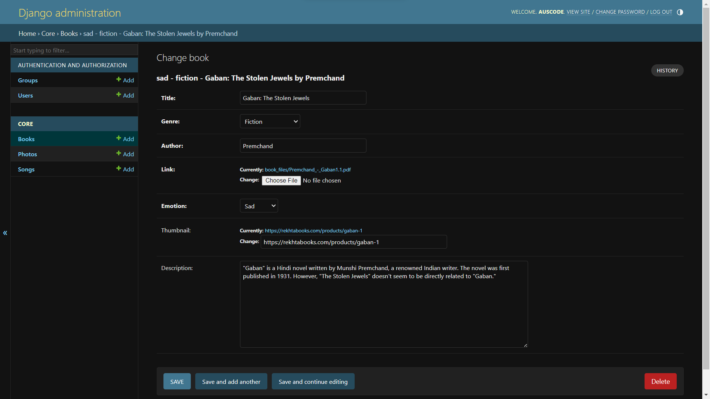
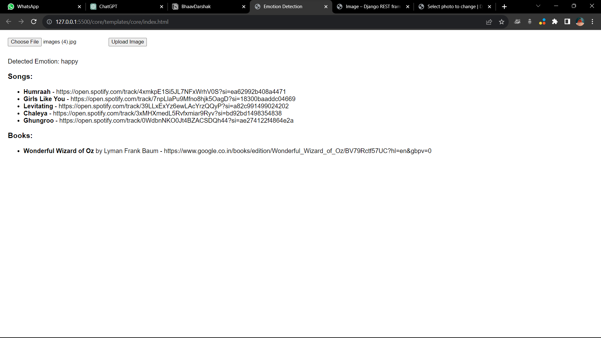
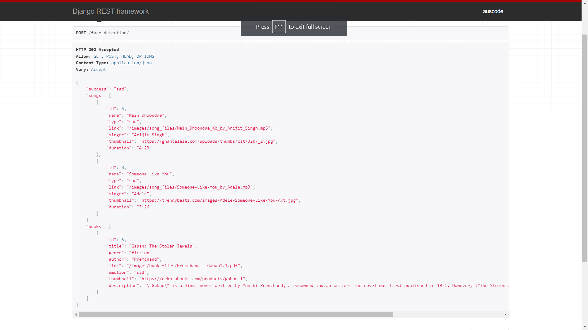
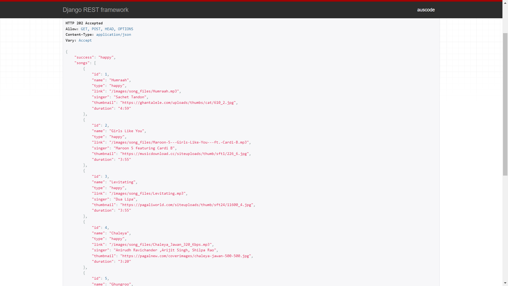
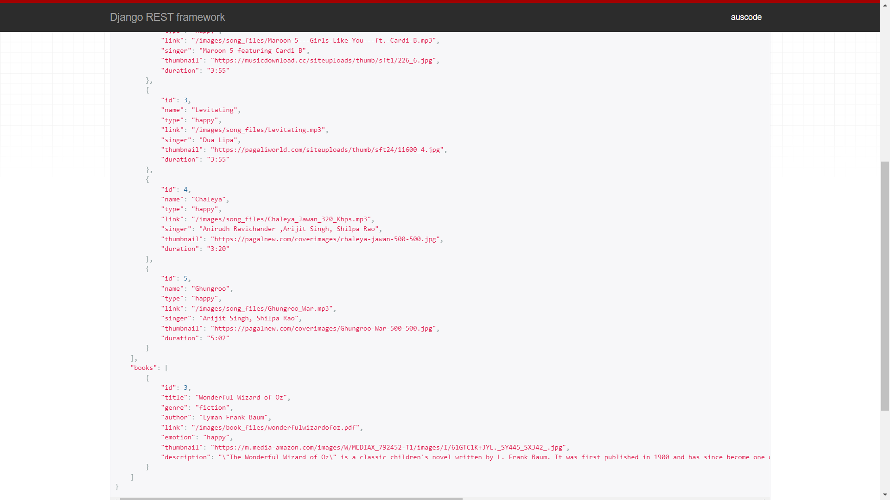
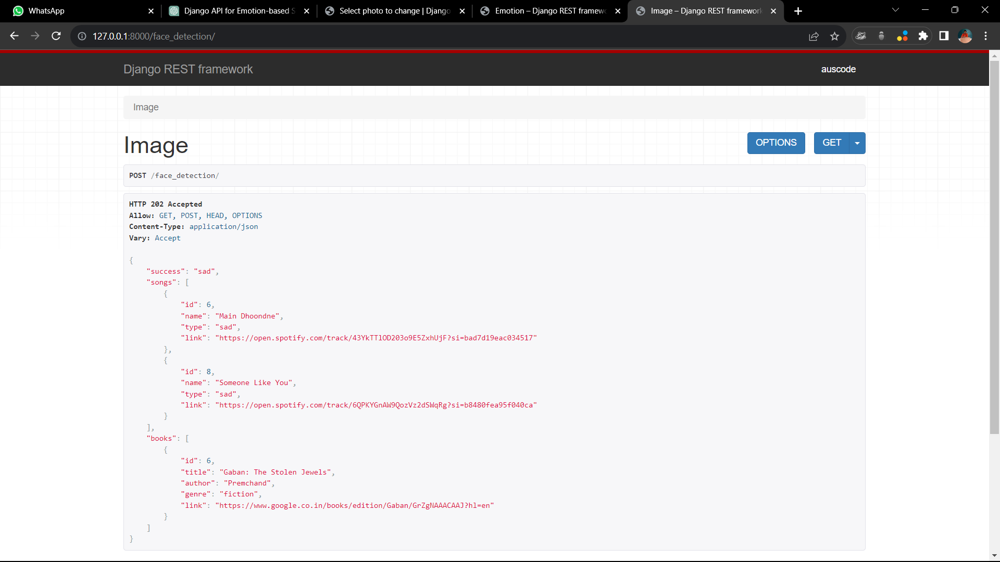
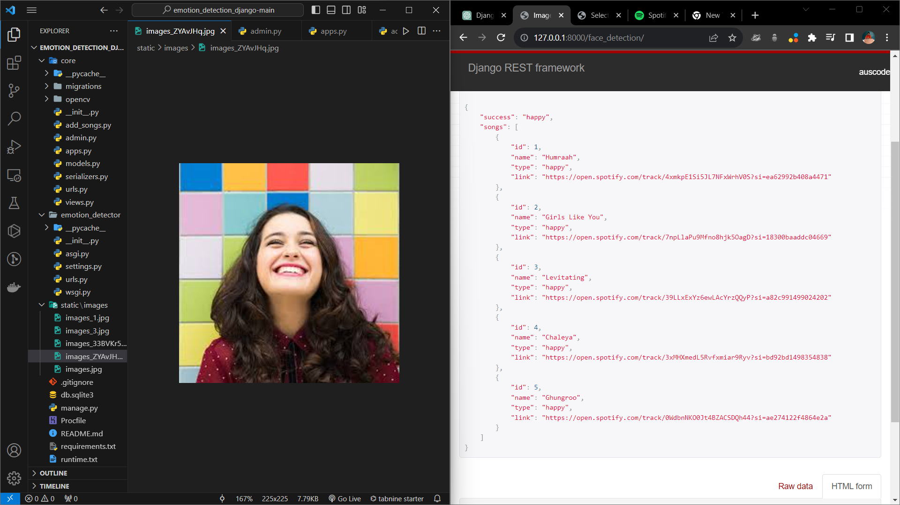
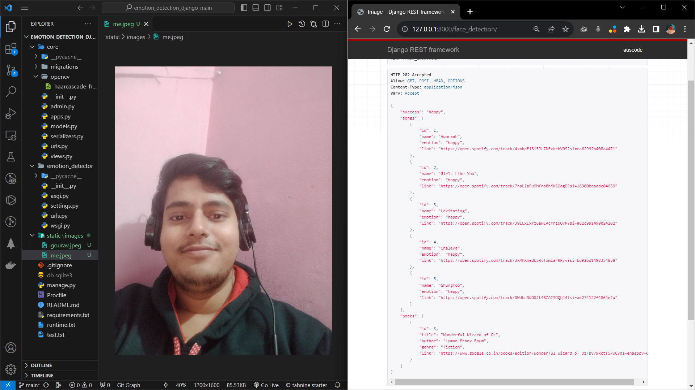
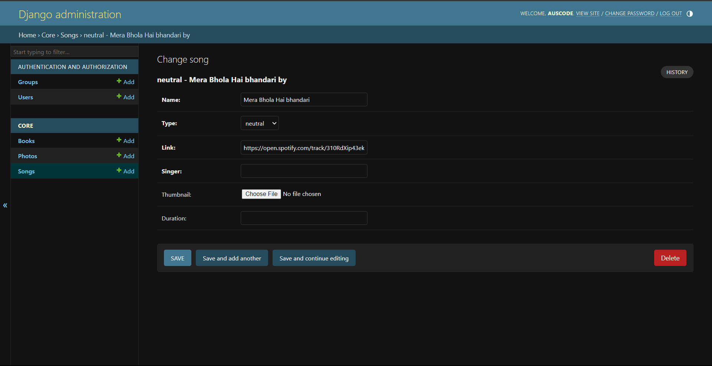

# Emotion Detection Django Project

This Django project uses facial emotion detection to recommend songs and books based on the detected emotion.

## Demo Images

- 
- 
- 
- 
- 
- 
- 
- 
- 
- 
- 
- .png)


## Project Structure

The project has the following structure:

- **core:** Core application of the Django project.
- **demoImages:** Folder containing image files for testing the emotion detection.
- **emotion_detector:** Django app for handling emotion detection and recommendations.
- **static:** Static files for the project.
- **db.sqlite3:** SQLite database file.

## Installation

Follow these steps to set up and run the project:

1. Clone the repository:

    ```bash
    git clone <repository_url>
    cd emotion_detection_django-main
    cd emotion_detection_django-main
    ```

2. Create a virtual environment (optional but recommended):

    ```bash
    python -m venv venv
    source venv/bin/activate  # On Windows: venv\Scripts\activate
    ```

3. Install dependencies:

    ```bash
    pip install -r requirements.txt
    ```

4. Apply migrations:

    ```bash
    python manage.py migrate
    ```

5. Run the development server:

    ```bash
    python manage.py runserver
    ```

6. Visit `http://127.0.0.1:8000/face_detection/` in your web browser to access the face detection endpoint.
## Usage

1. Post an image to the `face_detection/` endpoint using a tool like Postman or by making a POST request to the endpoint.

2. The server will detect emotions, recommend songs and books based on the detected emotion, and return the results.

## Notes

- The project uses TensorFlow for emotion detection, Cloudinary for image storage, and Django for the web framework.

- Ensure that your environment supports the required dependencies, including TensorFlow.

- This project assumes proper configuration of the database and Cloudinary settings.

- Additional configurations such as database settings may be needed for production deployment.

